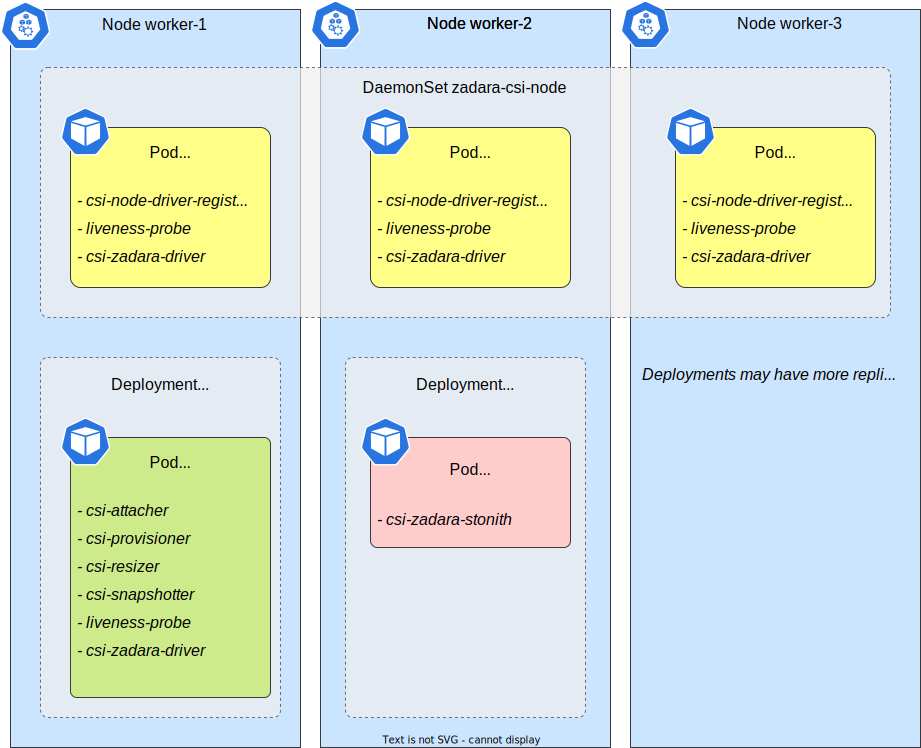

# CSI Driver components

This is a simplified overview of CSI Driver components and their responsibilities.

Many details are omitted (e.g, CSI APIs for k8s, which are not useful for the end-user).

## Controller

Runs as a Deployment, typically 1-2 Pods (but only 1 leader).

- CSI Controller Server
    - Create/Delete Volumes
    - Attach/Detach Volumes

- Reconcile [Custom Resources](custom_resources_generated.md)

- Monitoring of VSC resources

### Containers

- `csi-zadara-driver`

- Sidecar containers. Provided by K8s CSI maintainers, responsible for K8s-specific operations (e.g, watch PVCs and Pods
  and call appropriate CSI API).
    - `csi-provisioner`
    - `csi-attacher`
    - `csi-snapshotter`
    - `csi-resizer`
    - `liveness-probe`

## Node

Runs as a DaemonSet, 1 Pod on each Node. Requires elevated privileges.

- CSI Node Server
    - Mount volumes on the Node and in containers
    - iSCSI sessions management

- Register K8s Node in VSC (i.e, create VSCNode)

### Containers

- `csi-zadara-driver`
- Sidecar containers:
    - `csi-node-driver-registrar`: creates a gRPC socket, then CSI Node API are called directly by `kubelet`
    - `liveness-probe`

## Stonith

Runs as a Deployment, typically 1-2 Pods (but only 1 leader).
[Regarding the name](https://en.wikipedia.org/wiki/STONITH).

- Handle Node failures
    - force-detach Volumes from the failed Node
    - force-delete Pods from the failed Node

_Only resources that are related to the CSI driver are evacuated
(i.e, zadara-csi Volumes and Pods which are using them)_
