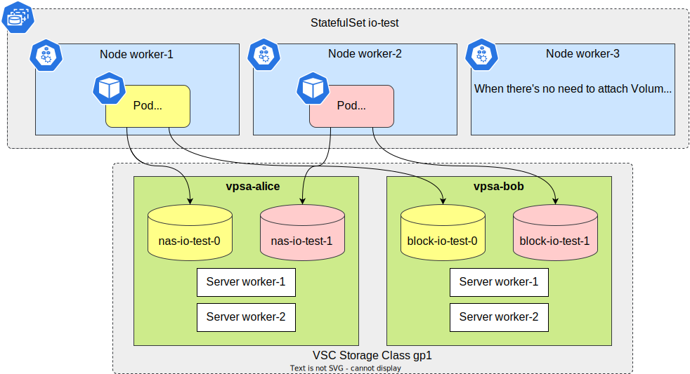

<!--- Auto-generated by https://github.com/norwoodj/helm-docs DO NOT EDIT --->

# Example workload

This Chart creates a StatefulSet, with on option to create NAS, Block, or both volumes for each replica.

With default values, installing this Chart creates a workload similar to this:


- Each replica uses `busybox` image to run `dd` in an infinite loop, alternating between mounted volumes.
- _Volumes may be scheduled differently across the VPSAs_
- _Dynamically provisioned volumes have names in form of 'pvc-239fa11d-7192-419a' (same as PV)
  In this diagram we use PVC names instead, for readability_

## Requirements

- [Install Zadara-CSI driver](helm_deploy.md)

- [Create VSCStorageClass and at least one VPSA](configuring_vsc.md).

- Either set one VSCStorageClass as default, or choose VSCStorageClass explicitly in Chart Values.

<details>
<summary>Click to read more about VSCStorageClass</summary>

[Create VSC StorageClass](configuring_vsc.md#create-vsc-storageclass)

Check whether a default VSCStorageClass is present (`DEFAULT` is true):

```shell
$ kubectl get vscsc
NAME                     STATUS   DEFAULT   MEMBERS   CAPACITY MODE   AGE
vscstorageclass-sample   Ready    true      1         normal          20h
```

You can also update an existing VSCStorageClass and set it as default, using `kubectl edit` or `kubectl patch`:

```shell
$ kubectl patch vscsc vscstorageclass-sample --patch '{"spec":{"isDefault":true}}' --type=merge
vscstorageclass.storage.zadara.com/vscstorageclass-sample patched
```

To use non-default VSCStorageClass, do either:

- set `storageClass.parameters.VSCStorageClassName` in `values.yaml`
- use `helm install` with `--set storageClass.parameters.VSCStorageClassName=YOUR_VSCSTORAGECLASS_NAME_HERE` argument.

---
</details>

## Quickstart

🛈 Examples use `zadara-csi-helm/zadara-csi` Helm repository If you are using local Chart,
replace `zadara-csi-helm/zadara-csi` with `./helm/zadara-csi`

To add Helm repository:

```
$ helm repo add zadara-csi-helm https://raw.githubusercontent.com/zadarastorage/zadara-csi/release/helm
```

There are no required values, you can install with all defaults:

```
$ helm install io-test zadara-csi-helm/example-workload
```

### Most common examples

- Run with NAS volumes only (block volumes have
  [additional requirements](prerequisites.md#additional-requirements-for-block-volumes)):
  ```shell
  $ helm install io-test zadara-csi-helm/example-workload --set blockVolumes.enabled=false
  ```

- Run with Block volumes only:
  ```shell
  $ helm install io-test zadara-csi-helm/example-workload --set NASVolumes.enabled=false
  ```

- Set VSC StorageClass name (for example, `zadara-vpsa`) in command line:
  ```shell
  $ helm install io-test zadara-csi-helm/example-workload --set storageClass.parameters.VSCStorageClassName=zadara-vpsa
  ```

- Choose number of replicas (of course, you can also scale it after installing):
  ```shell
  $ helm install io-test zadara-csi-helm/example-workload --set statefulSet.replicas=1
  ```

### Verify installation

If everything went well, you should see I/O progress messages in Pod logs, and I/O metering on VPSAs:

```
$ kubectl logs io-test-0 --follow

Tue Jan 4 11:55:45 UTC 2022 Write to NAS Volume: /mnt/csi
1000+0 records in
1000+0 records out
1048576000 bytes (1000.0MB) copied, 8.866004 seconds, 112.8MB/s
Tue Jan 4 11:55:54 UTC 2022 Write to block Volume: /dev/sdx
1000+0 records in
1000+0 records out
1048576000 bytes (1000.0MB) copied, 7.047216 seconds, 141.9MB/s
```

## Uninstall

⚠ Uninstalling the Chart will also delete all created Persistent Volume Claims of the StatefulSet.

If you prefer disabling this, use `--set cleanup.enabled=false` when installing this Chart.

## Values reference

It is possible to configure the Chart to run any other container and any command of your choice, by setting `pod.image`
, `pod.args` and `pod.env`.

| Key | Type | Default | Description |
|-----|------|---------|-------------|
| statefulSet.replicas | int | `2` | Number of replicas in StatefulSet |
| pod.image | string | `"busybox:latest"` | Image for the container to run |
| pod.args | list | *omitted: `dd` on one or both mounted volumes* | Container entry point. Used as is - you can add or change values as you want |
| pod.env | list | *omitted* | Environment variables for the container. Used as is - you can add or change values as you want |
| pod.tolerationSeconds.nodeNotReady | int | `30` | threshold for "node.kubernetes.io/not-ready" toleration. This corresponds to the NodeCondition `Ready` being "False". |
| pod.tolerationSeconds.nodeUnreachable | int | `30` | threshold for "node.kubernetes.io/unreachable" toleration. This corresponds to the NodeCondition `Ready` being "Unknown". |
| storageClass | object | *omitted* | storageClass values are mapped to the corresponding StorageClass fields |
| storageClass.create | bool | `true` | If `create` is true, create a new StorageClass, otherwise - use the existing one as specified by existingStorageClassName. |
| storageClass.existingStorageClassName | string | `""` | Name of the StorageClass to use. If `storageClass.create` is true, this field is ignored. Empty string means default StorageClass. |
| storageClass.parameters | object | `{"VSCStorageClassName":""}` | vendor-specific parameters |
| storageClass.parameters.VSCStorageClassName | string | `""` | Name of VSCStorageClass to use for Volume provisioning.  If empty - default VSCStorageClass will be used. |
| storageClass.reclaimPolicy | string | `"Delete"` | reclaimPolicy: Retain or Delete https://kubernetes.io/docs/concepts/storage/storage-classes/#reclaim-policy |
| storageClass.provisioner | string | `"csi.zadara.com"` | Name of the CSI driver. |
| storageClass.mountOptions | list | `[]` | Mount options. Only applicable for NAS, ignored for block volumes. |
| NASVolumes.enabled | bool | `true` | Create NAS PVC for each replica. Other parameters are same as in PVC spec: https://kubernetes.io/docs/concepts/storage/persistent-volumes/#persistentvolumeclaims |
| NASVolumes.accessMode | string | `"ReadWriteMany"` |  |
| NASVolumes.readOnly | bool | `false` |  |
| NASVolumes.capacity | string | `"50Gi"` |  |
| NASVolumes.mountPath | string | `"/mnt/csi"` |  |
| blockVolumes.enabled | bool | `true` | Create Block PVC for each replica. Other parameters are same as in PVC spec: https://kubernetes.io/docs/concepts/storage/persistent-volumes/#persistentvolumeclaims |
| blockVolumes.accessMode | string | `"ReadWriteOnce"` |  |
| blockVolumes.readOnly | bool | `false` |  |
| blockVolumes.capacity | string | `"50Gi"` |  |
| blockVolumes.devicePath | string | `"/dev/sdx"` |  |
| cleanup.enabled | bool | `true` | Run Helm pre-delete hook and delete StatefulSet PVCs (k8s does not delete them automatically). |
| cleanup.image | string | `"bitnami/kubectl:1.23"` | Image for cleanup hook. Requires `kubectl` installed. |
