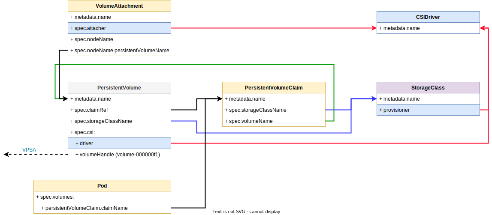

# Migration from CSI 1.*x* to CSI 2.0

## Overview

1. Prepare for migration
    - extract values from the currently installed CSI 1.x Charts and save them as a ConfigMap.
    - configure migrator `Job`

2. Uninstall all CSI 1.x drivers

3. Run `migrator` tool.

4. Install CSI 2.0 to complete the migration.

This process does not affect the application or I/O and is completely transparent to the user.

## About this guide

We provide an example for migrating 2 CSI v1.x instances: `csi-alice` and `csi-bob`.
The procedure can be applied to any number of CSI v1.x instances.

To simulate application pods, we use [example-workload Chart](./example_workload.md).


- _Arrows represent references between k8s objects.
  For example, Pod keeps a reference to the Node it is running on.
  VolumeAttachments keep a reference to the PV, the Node PV is attached to,
  and the CSIDriver that manages the attachment._

- _Red arrows are the references that are modified during the migration._

From Helm point-of-view:

```
$ helm list
NAME            NAMESPACE       REVISION        UPDATED                                 STATUS          CHART                   APP VERSION
csi-alice       zcenter         1               2022-06-15 10:00:15.604168394 +0300 IDT deployed        zadara-csi-2.3.3        1.3.10
csi-bob         zcenter         1               2022-06-15 10:00:31.176651857 +0300 IDT deployed        zadara-csi-2.3.3        1.3.10
io-test         zcenter         1               2022-06-15 10:36:54.635560114 +0300 IDT deployed        example-workload-1.0.0
```

Installed CSI drivers (note the `provisioner` name i.e, `NAME` of the `csidriver`):

```
$ kubectl get csidrivers.storage.k8s.io
NAME                   ATTACHREQUIRED   PODINFOONMOUNT   STORAGECAPACITY   TOKENREQUESTS   REQUIRESREPUBLISH   MODES                  AGE
csi-alice.zadara.com   true             true             false             <unset>         false               Persistent             48m
csi-bob.zadara.com     true             true             false             <unset>         false               Persistent             48m
```

## Migration steps

### Prepare for migration

#### Extract values from the currently installed CSI 1.x Charts

Get computed values (the defaults merged with user overrides) from installed Zadara-CSI 1.x Helm Chart:

```shell
$ helm get values csi-alice --all
$ helm get values csi-bob   --all
```

Save Values YAML in a file, except for the "COMPUTED VALUES" line:

```shell
$ helm get values csi-alice --all | grep -v "COMPUTED VALUES" > values-alice.yaml
$ helm get values csi-bob   --all | grep -v "COMPUTED VALUES" > values-bob.yaml
```

Create a ConfigMap containing computed values from all `*.yaml` files from previous step.
We recommend using `csi-v1-values` name as it is used in the example, to be consistent with the following steps.

```shell
$ kubectl create configmap csi-v1-values --from-file ./values-alice.yaml --from-file ./values-bob.yaml
configmap/csi-v1-values created
```

#### Configure migrator `Job`

Edit [migration_job.yaml](../deploy/migration/migration_job.yaml), follow the `OPTIONAL` and `REQUIRED` comments.

`ClusterRoleBinding` **requires** a proper `namespace` in reference to the `ServiceAccount`.

```yaml
apiVersion: rbac.authorization.k8s.io/v1
kind: ClusterRoleBinding
metadata:
  name: csi-migrator-rolebinding
roleRef:
  apiGroup: rbac.authorization.k8s.io
  kind: ClusterRole
  name: csi-migrator-role
subjects:
  - kind: ServiceAccount
    name: csi-migrator-sa
    ## REQUIRED: current default namespace,
    ## or the namespace of the job (if created in a different namespace).
    ## Run `kubectl config view -o jsonpath='{..namespace}'; echo` to get the current namespace.
    namespace: default
```

In job definition **all configuration is optional**.
Notable options are:

- If using a different _name for CSI v1.x configmap_, change the `csi-v1-values` name in `volumes` section.
- Several _dry-run_ options are available.
- You can save a YAML backup of resources that are being modified.
  See `yaml-backup` in `volumes` section.
  This is typically used together with following parameters:
    - `nodeSelector` based on Node labels, to run on a specific node.
    - `hostPath.path` that defines a path to a directory on the Node.
    - `securityContext` to set a proper ownership for the files (otherwise the files will be owned by the root user).

```yaml
## OPTIONAL: use batch/v1beta1 with older k8s versions (<1.21)
apiVersion: batch/v1
kind: Job
metadata:
  name: csi-migrator-job
spec:
  template:
    metadata:
      labels:
        app: csi-migrator
    spec:
      ## OPTIONAL: use a specific node (useful for yaml-backup hostPath volume)
      #nodeSelector:
      #  kubernetes.io/hostname: node-12345
      activeDeadlineSeconds: 120
      restartPolicy: OnFailure
      serviceAccountName: csi-migrator-sa
      containers:
        - name: csi-migrator
          ## OPTIONAL: use custom registry
          image: "zadara/csi-migrator-1to2:2.1.0"
          args:
            - "migrator"
            ## OPTIONAL: Name for the new CSI driver to create.
            ## Can be a name of one of the existing CSI drivers or a new name.
            ## We recommend using default "csi.zadara.com".
            - "--new-csi-driver-name"
            - "csi.zadara.com"
            ## OPTIONAL: Name for the new VSCStorageClass Custom Resource.
            - "--vsc-storage-class-name"
            - "zadara-vpsa"
            - "--values-dir-path"
            - "/config/values"
            - "--crd-path"
            - "/config/crd/bases"
            - "--backup-dir-path"
            - "/backup"
            ## OPTIONAL: Dry run mode: --dry-run {no-changes, crd-only, non-disruptive, none}.
            ##  - no-changes: do not persist any changes
            ##  - crd-only: only install CRD, dry-run for the rest
            ##  - non-disruptive: allow creating new objects but no modification of existing ones
            ##  - none: no dry-run, persist all changes
            - "--dry-run"
            - "none"
            - "--log-level"
            - "debug"
          volumeMounts:
            - mountPath: /config/values
              name: values-configmap
            - mountPath: /backup
              name: yaml-backup
          ## OPTIONAL: user IDs will affect ownership of created files in yaml-backup directory.
          ## Typically, this should be the same as the user running the job.
          ## Run `id --user` and id --group` to get the user and group IDs of the current user.
          #securityContext:
          #  runAsUser: 1000
          #  runAsGroup: 1000
      volumes:
        - name: values-configmap
          configMap:
            ## OPTIONAL: name of a configMap containing values.yaml of CSI v1.x
            ## Only required if you used a different name for the configmap in the previous step.
            name: "csi-v1-values"
            optional: false
        ## OPTIONAL: mount a hostPath directory for backing up yaml files before applying any changes.
        ## Replace `emptyDir` with `hostPath` to enable.
        ## See also `securityContext`, and `nodeSelector` above for more details.
        - name: yaml-backup
          emptyDir: {}
          #hostPath:
          #  path: /tmp/csi/backups
          #  type: DirectoryOrCreate
```

ClusterRole does not require any changes.

```yaml
apiVersion: rbac.authorization.k8s.io/v1
kind: ClusterRole
metadata:
  name: csi-migrator-role
rules:
  - apiGroups: [ "" ]
    resources: [ "persistentvolumes" ]
    verbs: [ "get", "list", "watch", "create", "update", "patch", "delete" ]
  - apiGroups: [ "storage.k8s.io" ]
    resources: [ "storageclasses", "volumeattachments" ]
    verbs: [ "get", "list", "watch", "create", "update", "patch", "delete" ]
  - apiGroups: [ "storage.k8s.io" ]
    resources: [ "csidrivers" ]
    verbs: [ "get", "list", "watch" ]
  - apiGroups: [ "apiextensions.k8s.io" ]
    resources: [ "customresourcedefinitions" ]
    verbs: [ "create" ]
  - apiGroups: [ "storage.zadara.com" ]
    resources: [ "*" ]
    verbs: [ "*" ]
```

ServiceAccount does not require any changes.

```yaml
apiVersion: v1
kind: ServiceAccount
metadata:
  name: csi-migrator-sa
```

---

### Uninstall CSI v1.x drivers

This step comes before running migration to make sure that CSI resources do not change during migration process.

Uninstall all CSI v1.x drivers:

```shell
$ helm uninstall csi-alice csi-bob
```

🛈 Uninstalling does not affect I/O or any _existing_ resources.
_New_ PVCs and Pods will wait in `Pending` state, until a new CSI driver is deployed.

### Run migrator

```shell
$ kubectl apply -f ./deploy/migration/migration_job.yaml
job.batch/csi-migrator-job created
clusterrole.rbac.authorization.k8s.io/csi-migrator-role created
serviceaccount/csi-migrator-sa created
clusterrolebinding.rbac.authorization.k8s.io/csi-migrator-rolebinding created
```

When finished you will see a completed Job and its Pod:

```
$ kubectl get jobs,pods
NAME                         COMPLETIONS   DURATION   AGE
job.batch/csi-migrator-job   1/1           11s        6m11s

NAME                            READY   STATUS      RESTARTS   AGE
pod/csi-migrator-job--1-npvr8   0/1     Completed   0          6m1s
```

This is an example of Custom Resources, created after running the migrator.

```
volumeattachment.storage.zadara.com
$ kubectl get volumeattachment.storage.zadara.com -o wide
  NAME                                                       STATUS     ISCSI    VOLUME                                     VSCNODE           AGE
  pvc-b5f9e42c-5e6f-478d-b23f-c401013d8508.k8s-base-master   Creating   Active   pvc-b5f9e42c-5e6f-478d-b23f-c401013d8508   k8s-base-master   11m
  pvc-f4f8595f-143f-47a1-8522-58ebb8e29816.k8s-base-master   Creating   Active   pvc-f4f8595f-143f-47a1-8522-58ebb8e29816   k8s-base-master   11m

volume.storage.zadara.com
$ kubectl get volume.storage.zadara.com -o wide
  NAME                                       STATUS         TYPE   CAPACITY   VPSA        AGE
  pvc-b5f9e42c-5e6f-478d-b23f-c401013d8508   Provisioning   NAS    50Gi       csi-alice   11m
  pvc-f4f8595f-143f-47a1-8522-58ebb8e29816   Provisioning   NAS    50Gi       csi-bob     11m

vpsa.storage.zadara.com
$ kubectl get vpsa.storage.zadara.com -o wide
  NAME        STATUS   DISPLAY NAME   HOSTNAME                                 VERSION   CAPACITY MODE   TOTAL   AVAILABLE   VSC           AGE
  csi-alice            csi-alice      vsa-0000028d-zadara-qa9.zadaravpsa.com                                                 zadara-vpsa   11m
  csi-bob              csi-bob        vsa-0000029d-zadara-qa9.zadaravpsa.com                                                 zadara-vpsa   11m

vscstorageclass.storage.zadara.com
$ kubectl get vscstorageclass.storage.zadara.com -o wide
  NAME          STATUS   DEFAULT   MEMBERS   CAPACITY MODE   TOTAL   AVAILABLE   AGE
  zadara-vpsa            true                                                    11m
```

🛈 VSCNode custom resource (one for each K8s Node) is not created at this point, it will be created by CSI 2.0 after
installation.

Detailed overview with example logs:

<details>
<summary>Click to expand</summary>

#### Installing CSI 2.0 Custom Resource Definitions (CRDs)

Migrator installs the following CRDs:

```shell
$ kubectl get crd | grep zadara
snapshots.storage.zadara.com                         2022-06-15T14:43:41Z
volumeattachments.storage.zadara.com                 2022-06-15T14:43:41Z
volumes.storage.zadara.com                           2022-06-15T14:43:41Z
vpsas.storage.zadara.com                             2022-06-15T14:43:41Z
vscnodes.storage.zadara.com                          2022-06-15T14:43:41Z
vscstorageclasses.storage.zadara.com                 2022-06-15T14:43:41Z
```

Example logs:

```
  Jun 15 14:43:41.660039 [migrator] [1] [INFO]                                      main.main[ 144] Create Custom Resource Definitions for CSI 2.0. CRDs are installed once for all CSI 1.x instances |
  Jun 15 14:43:41.661216 [migrator] [1] [INFO]                                main.createCRDs[  33] Read resource from path | path: /config/crd/bases/storage.zadara.com_snapshots.yaml
  Jun 15 14:43:41.666639 [migrator] [1] [INFO]                                main.createCRDs[  33] Read resource from path | path: /config/crd/bases/storage.zadara.com_volumeattachments.yaml
  Jun 15 14:43:41.668653 [migrator] [1] [INFO]                                main.createCRDs[  33] Read resource from path | path: /config/crd/bases/storage.zadara.com_volumes.yaml
  Jun 15 14:43:41.671829 [migrator] [1] [INFO]                                main.createCRDs[  33] Read resource from path | path: /config/crd/bases/storage.zadara.com_vpsas.yaml
  Jun 15 14:43:41.674798 [migrator] [1] [INFO]                                main.createCRDs[  33] Read resource from path | path: /config/crd/bases/storage.zadara.com_vscnodes.yaml
  Jun 15 14:43:41.677036 [migrator] [1] [INFO]                                main.createCRDs[  33] Read resource from path | path: /config/crd/bases/storage.zadara.com_vscstorageclasses.yaml
  Jun 15 14:43:41.679452 [migrator] [1] [INFO]                                 main.k8sCreate[ 241] Create CustomResourceDefinition | CustomResourceDefinition: snapshots.storage.zadara.com, dryRun: false
  Jun 15 14:43:41.685861 [migrator] [1] [INFO]                                 main.k8sCreate[ 241] Create CustomResourceDefinition | CustomResourceDefinition: volumeattachments.storage.zadara.com, dryRun: false
  Jun 15 14:43:41.697932 [migrator] [1] [INFO]                                 main.k8sCreate[ 241] Create CustomResourceDefinition | dryRun: false, CustomResourceDefinition: volumes.storage.zadara.com
  Jun 15 14:43:41.711415 [migrator] [1] [INFO]                                 main.k8sCreate[ 241] Create CustomResourceDefinition | dryRun: false, CustomResourceDefinition: vpsas.storage.zadara.com
  Jun 15 14:43:41.723171 [migrator] [1] [INFO]                                 main.k8sCreate[ 241] Create CustomResourceDefinition | CustomResourceDefinition: vscnodes.storage.zadara.com, dryRun: false
  Jun 15 14:43:41.730420 [migrator] [1] [INFO]                                 main.k8sCreate[ 241] Create CustomResourceDefinition | dryRun: false, CustomResourceDefinition: vscstorageclasses.storage.zadara.com
  Jun 15 14:43:41.739618 [migrator] [1] [INFO]                                      main.main[ 148] Successfully created Custom Resource Definitions. |
```

#### Creating Custom Resources

CSI 2.0 uses Custom Resources for managing storage across multiple VPSAs. Migrator creates the following resources:

- VSCStorageClass: one for all CSI 1.x instances.
- VPSA: one for each CSI v1.x driver.
- Volume: one for each PV.
- VolumeAttachment.storage.zadara.com (VA): create one for each VolumeAttachment, update with VPSA Server info.
    - `VolumeAttachment.storage.k8s.io` is a Custom Resource defined by K8s CSI community, indicates the attachment of a
      PV to a Node managed by CSI Driver.
    - `VolumeAttachment.storage.zadara.com` is a Custom Resource defined by Zadara, contains VPSA Server info.

Example logs:

```
  Jun 15 14:43:41.739697 [migrator] [1] [INFO]                                      main.main[ 152] Import CSI 1.x resources as Custom Resources for CSI 2.0 |
  Jun 15 14:43:41.739741 [migrator] [1] [INFO]                                      main.main[ 154] Importing CSI 1.x resources as Custom Resources for CSI 2.0 | provisioner: csi-alice.zadara.com
  Jun 15 14:43:41.740781 [migrator] [1] [INFO]                                 main.k8sCreate[ 241] Create VSCStorageClass | VSCStorageClass: zadara-vpsa, dryRun: false
  Jun 15 14:43:44.498260 [migrator] [1] [INFO]                                 main.k8sCreate[ 241] Create VPSA | dryRun: false, VPSA: csi-alice
  Jun 15 14:43:44.535621 [migrator] [1] [INFO]                                   main.migrate[  68] Create Volumes Custom Resources |
  Jun 15 14:43:44.535712 [migrator] [1] [INFO]                              main.convertAllPV[  84] List all PersistentVolumes |
  Jun 15 14:43:44.639611 [migrator] [1] [INFO]                              main.convertAllPV[  89] Consider only PersistentVolumes of CSIDriver csi-alice.zadara.com |
  Jun 15 14:43:44.639728 [migrator] [1] [INFO]                              main.convertOnePV[ 125] Get VPSA Volume | PersistentVolume: pvc-b5f9e42c-5e6f-478d-b23f-c401013d8508, VPSAVolume: volume-00000140
  Jun 15 14:43:45.539588 [migrator] [1] [INFO]                              main.convertAllPV[ 108] Selected PersistentVolumes for migration | CSIDriver: csi-alice.zadara.com, total: 2, selected: 1
  Jun 15 14:43:45.539718 [migrator] [1] [INFO]                                 main.k8sCreate[ 241] Create Volume | Volume: pvc-b5f9e42c-5e6f-478d-b23f-c401013d8508, dryRun: false
  Jun 15 14:43:45.579581 [migrator] [1] [INFO]                           main.k8sUpdateStatus[ 297] Set Volume status | Volume: pvc-b5f9e42c-5e6f-478d-b23f-c401013d8508, dryRun: false
  Jun 15 14:43:45.586190 [migrator] [1] [INFO]                                   main.migrate[  74] Create VolumeAttachments.storage.zadara.com Custom Resources |
  Jun 15 14:43:45.586313 [migrator] [1] [INFO]                             main.convertAllVAs[ 170] List Servers of VPSA Volume | PersistentVolume: pvc-b5f9e42c-5e6f-478d-b23f-c401013d8508, VPSAVolume: volume-00000140
  Jun 15 14:43:45.618527 [migrator] [1] [INFO]                                 main.k8sCreate[ 241] Create VolumeAttachment | VolumeAttachment: pvc-b5f9e42c-5e6f-478d-b23f-c401013d8508.k8s-base-master, dryRun: false
  Jun 15 14:43:45.652448 [migrator] [1] [INFO]                           main.k8sUpdateStatus[ 297] Set VolumeAttachment status | VolumeAttachment: pvc-b5f9e42c-5e6f-478d-b23f-c401013d8508.k8s-base-master, dryRun: false
  Jun 15 14:43:45.658877 [migrator] [1] [INFO]                                      main.main[ 154] Importing CSI 1.x resources as Custom Resources for CSI 2.0 | provisioner: csi-bob.zadara.com
  Jun 15 14:43:45.659772 [migrator] [1] [INFO]                                 main.k8sCreate[ 241] Create VSCStorageClass | VSCStorageClass: zadara-vpsa, dryRun: false
  Jun 15 14:43:45.668783 [migrator] [1] [WARN]                                   main.migrate[  47] VSCStorageClass already exists | name: zadara-vpsa
  Jun 15 14:43:45.668871 [migrator] [1] [INFO]                                 main.k8sCreate[ 241] Create VPSA | VPSA: csi-bob, dryRun: false
  Jun 15 14:43:45.679384 [migrator] [1] [INFO]                                   main.migrate[  68] Create Volumes Custom Resources |
  Jun 15 14:43:45.679485 [migrator] [1] [INFO]                              main.convertAllPV[  84] List all PersistentVolumes |
  Jun 15 14:43:45.679843 [migrator] [1] [INFO]                              main.convertAllPV[  89] Consider only PersistentVolumes of CSIDriver csi-bob.zadara.com |
  Jun 15 14:43:45.679921 [migrator] [1] [INFO]                              main.convertOnePV[ 125] Get VPSA Volume | PersistentVolume: pvc-f4f8595f-143f-47a1-8522-58ebb8e29816, VPSAVolume: volume-000000f1
  Jun 15 14:43:46.503831 [migrator] [1] [INFO]                              main.convertAllPV[ 108] Selected PersistentVolumes for migration | total: 2, selected: 1, CSIDriver: csi-bob.zadara.com
  Jun 15 14:43:46.503940 [migrator] [1] [INFO]                                 main.k8sCreate[ 241] Create Volume | Volume: pvc-f4f8595f-143f-47a1-8522-58ebb8e29816, dryRun: false
  Jun 15 14:43:46.512766 [migrator] [1] [INFO]                           main.k8sUpdateStatus[ 297] Set Volume status | Volume: pvc-f4f8595f-143f-47a1-8522-58ebb8e29816, dryRun: false
  Jun 15 14:43:46.518369 [migrator] [1] [INFO]                                   main.migrate[  74] Create VolumeAttachments.storage.zadara.com Custom Resources |
  Jun 15 14:43:46.518463 [migrator] [1] [INFO]                             main.convertAllVAs[ 170] List Servers of VPSA Volume | PersistentVolume: pvc-f4f8595f-143f-47a1-8522-58ebb8e29816, VPSAVolume: volume-000000f1
  Jun 15 14:43:46.551436 [migrator] [1] [INFO]                                 main.k8sCreate[ 241] Create VolumeAttachment | VolumeAttachment: pvc-f4f8595f-143f-47a1-8522-58ebb8e29816.k8s-base-master, dryRun: false
  Jun 15 14:43:46.555907 [migrator] [1] [INFO]                           main.k8sUpdateStatus[ 297] Set VolumeAttachment status | VolumeAttachment: pvc-f4f8595f-143f-47a1-8522-58ebb8e29816.k8s-base-master, dryRun: false
  Jun 15 14:43:46.560721 [migrator] [1] [INFO]                                      main.main[ 178] Successfully imported CSI 1.x resources as Custom Resources for CSI 2.0 |
```

#### Patching k8s storage resources

This step updates the following resources with references to the new CSI driver instance:

- StorageClass
- VolumeAttachment.storage.k8s.io
- PersistentVolume

Kubernetes does not allow updating CSI driver name (e.g, `provisioner` in the StorageClass).
To make the necessary changes, Migrator does the following:

- Save the original resources, and patch them with the new CSI driver name.
- Delete the original resource (at this point it is only marked as deleted due to
  the [finalizers](https://kubernetes.io/docs/concepts/overview/working-with-objects/finalizers/))
- Remove any existing finalizer from the original resource. Now the resource is actually deleted.
- Create new resource with the new CSI Driver name.

```
  Jun 15 14:43:46.560949 [migrator] [1] [INFO]                                      main.main[ 182] Patch CSI 1.x resources to use CSI 2.0. StorageClasses, PersistentVolumes and VolumeAttachments.storage.k8s.io will be force-deleted and re-created with the new CSI driver name |
  Jun 15 14:43:46.863783 [migrator] [1] [INFO]                                      main.main[ 210] Patching StorageClasses | provisioner: csi-alice.zadara.com
  Jun 15 14:43:46.864306 [migrator] [1] [INFO]                                      main.main[ 214] Patching StorageClass | name: csi-alice-nas, provisioner: csi-alice.zadara.com, newProvisioner: csi.zadara.com
  Jun 15 14:43:46.898727 [migrator] [1] [INFO]                                 main.k8sDelete[ 263] Delete StorageClass | StorageClass: csi-alice-nas, dryRun: false
  Jun 15 14:43:46.904005 [migrator] [1] [INFO]                                 main.k8sCreate[ 241] Create StorageClass | StorageClass: csi-alice-nas, dryRun: false
  Jun 15 14:43:46.908820 [migrator] [1] [INFO]                                      main.main[ 225] Patching VolumeAttachments.storage.k8s.io | provisioner: csi-alice.zadara.com
  Jun 15 14:43:46.909235 [migrator] [1] [INFO]                                      main.main[ 229] Patching VolumeAttachment.storage.k8s.io | newProvisioner: csi.zadara.com, name: csi-d6699814a8b6713449fee28002a3e0926415fa6915e6e7bd0cafd4887fc0747c, provisioner: csi-alice.zadara.com
  Jun 15 14:43:46.937097 [migrator] [1] [INFO]                                 main.k8sDelete[ 263] Delete VolumeAttachment | dryRun: false, VolumeAttachment: csi-d6699814a8b6713449fee28002a3e0926415fa6915e6e7bd0cafd4887fc0747c
  Jun 15 14:43:46.942507 [migrator] [1] [INFO]                                  main.k8sPatch[ 285] Patch VolumeAttachment | VolumeAttachment: csi-d6699814a8b6713449fee28002a3e0926415fa6915e6e7bd0cafd4887fc0747c, dryRun: false, patch: {"metadata":{"finalizers":[]}}
  Jun 15 14:43:46.948429 [migrator] [1] [INFO]                                 main.k8sCreate[ 241] Create VolumeAttachment | VolumeAttachment: csi-d6699814a8b6713449fee28002a3e0926415fa6915e6e7bd0cafd4887fc0747c, dryRun: false
  Jun 15 14:43:46.952758 [migrator] [1] [INFO]                                      main.main[ 240] Patching PersistentVolumes | provisioner: csi-alice.zadara.com
  Jun 15 14:43:46.954318 [migrator] [1] [INFO]                                      main.main[ 244] Patching PersistentVolume | name: pvc-b5f9e42c-5e6f-478d-b23f-c401013d8508, provisioner: csi-alice.zadara.com, newProvisioner: csi.zadara.com
  Jun 15 14:43:46.973564 [migrator] [1] [INFO]                                 main.k8sDelete[ 263] Delete PersistentVolume | PersistentVolume: pvc-b5f9e42c-5e6f-478d-b23f-c401013d8508, dryRun: false
  Jun 15 14:43:46.982792 [migrator] [1] [INFO]                                  main.k8sPatch[ 285] Patch PersistentVolume | PersistentVolume: pvc-b5f9e42c-5e6f-478d-b23f-c401013d8508, dryRun: false, patch: {"metadata":{"finalizers":[]}}
  Jun 15 14:43:46.998667 [migrator] [1] [INFO]                                 main.k8sCreate[ 241] Create PersistentVolume | PersistentVolume: pvc-b5f9e42c-5e6f-478d-b23f-c401013d8508, dryRun: false
  Jun 15 14:43:47.006524 [migrator] [1] [INFO]                                      main.main[ 210] Patching StorageClasses | provisioner: csi-bob.zadara.com
  Jun 15 14:43:47.008346 [migrator] [1] [INFO]                                      main.main[ 214] Patching StorageClass | name: csi-bob-nas, provisioner: csi-bob.zadara.com, newProvisioner: csi.zadara.com
  Jun 15 14:43:47.021975 [migrator] [1] [INFO]                                 main.k8sDelete[ 263] Delete StorageClass | StorageClass: csi-bob-nas, dryRun: false
  Jun 15 14:43:47.026304 [migrator] [1] [INFO]                                 main.k8sCreate[ 241] Create StorageClass | StorageClass: csi-bob-nas, dryRun: false
  Jun 15 14:43:47.032409 [migrator] [1] [INFO]                                      main.main[ 225] Patching VolumeAttachments.storage.k8s.io | provisioner: csi-bob.zadara.com
  Jun 15 14:43:47.033826 [migrator] [1] [INFO]                                      main.main[ 229] Patching VolumeAttachment.storage.k8s.io | newProvisioner: csi.zadara.com, name: csi-b005f095dbffb7ffa20ba6fd8694c7babfe39f3c3ccdb890b1f844f7a86d4341, provisioner: csi-bob.zadara.com
  Jun 15 14:43:47.039892 [migrator] [1] [INFO]                                 main.k8sDelete[ 263] Delete VolumeAttachment | VolumeAttachment: csi-b005f095dbffb7ffa20ba6fd8694c7babfe39f3c3ccdb890b1f844f7a86d4341, dryRun: false
  Jun 15 14:43:47.045169 [migrator] [1] [INFO]                                  main.k8sPatch[ 285] Patch VolumeAttachment | VolumeAttachment: csi-b005f095dbffb7ffa20ba6fd8694c7babfe39f3c3ccdb890b1f844f7a86d4341, dryRun: false, patch: {"metadata":{"finalizers":[]}}
  Jun 15 14:43:47.051533 [migrator] [1] [INFO]                                 main.k8sCreate[ 241] Create VolumeAttachment | VolumeAttachment: csi-b005f095dbffb7ffa20ba6fd8694c7babfe39f3c3ccdb890b1f844f7a86d4341, dryRun: false
  Jun 15 14:43:47.055775 [migrator] [1] [INFO]                                      main.main[ 240] Patching PersistentVolumes | provisioner: csi-bob.zadara.com
  Jun 15 14:43:47.056218 [migrator] [1] [INFO]                                      main.main[ 244] Patching PersistentVolume | provisioner: csi-bob.zadara.com, newProvisioner: csi.zadara.com, name: pvc-f4f8595f-143f-47a1-8522-58ebb8e29816
  Jun 15 14:43:47.062645 [migrator] [1] [INFO]                                 main.k8sDelete[ 263] Delete PersistentVolume | PersistentVolume: pvc-f4f8595f-143f-47a1-8522-58ebb8e29816, dryRun: false
  Jun 15 14:43:47.068882 [migrator] [1] [INFO]                                  main.k8sPatch[ 285] Patch PersistentVolume | patch: {"metadata":{"finalizers":[]}}, PersistentVolume: pvc-f4f8595f-143f-47a1-8522-58ebb8e29816, dryRun: false
  Jun 15 14:43:47.093575 [migrator] [1] [INFO]                                 main.k8sCreate[ 241] Create PersistentVolume | PersistentVolume: pvc-f4f8595f-143f-47a1-8522-58ebb8e29816, dryRun: false
  Jun 15 14:43:47.109676 [migrator] [1] [INFO]                                      main.main[ 261] Done |
```

#### Storage resources example after successful migration

StorageClasses, PVs and VolumeAttachments now refer to the new `csi.zadara.com` provisioner,
instead of `csi-alice.zadara.com` and `csi-bob.zadara.com`.

```
csidriver.storage.k8s.io
$ kubectl get csidriver.storage.k8s.io -o wide
  NAME                  ATTACHREQUIRED   PODINFOONMOUNT   STORAGECAPACITY   TOKENREQUESTS   REQUIRESREPUBLISH   MODES                  AGE
  hostpath.csi.k8s.io   true             true             false             <unset>         false               Persistent,Ephemeral   16d

storageclass.storage.k8s.io
$ kubectl get storageclass.storage.k8s.io -o wide
  NAME                    PROVISIONER           RECLAIMPOLICY   VOLUMEBINDINGMODE      ALLOWVOLUMEEXPANSION   AGE
  csi-alice-nas           csi.zadara.com        Delete          Immediate              true                   13m
  csi-bob-nas (default)   csi.zadara.com        Delete          Immediate              true                   13m
  csi-hostpath-sc         hostpath.csi.k8s.io   Delete          WaitForFirstConsumer   false                  16d

persistentvolumeclaim
$ kubectl get persistentvolumeclaim -o wide
  NAME            STATUS   VOLUME                                     CAPACITY   ACCESS MODES   STORAGECLASS    AGE   VOLUMEMODE
  nas-io-test-0   Bound    pvc-b5f9e42c-5e6f-478d-b23f-c401013d8508   50Gi       RWX            csi-alice-nas   45m   Filesystem
  nas-io-test-1   Bound    pvc-f4f8595f-143f-47a1-8522-58ebb8e29816   50Gi       RWX            csi-bob-nas     44m   Filesystem

persistentvolume
$ kubectl get persistentvolume -o wide
  NAME                                       CAPACITY   ACCESS MODES   RECLAIM POLICY   STATUS   CLAIM                   STORAGECLASS    REASON   AGE   VOLUMEMODE
  pvc-b5f9e42c-5e6f-478d-b23f-c401013d8508   50Gi       RWX            Delete           Bound    zcenter/nas-io-test-0   csi-alice-nas            13m   Filesystem
  pvc-f4f8595f-143f-47a1-8522-58ebb8e29816   50Gi       RWX            Delete           Bound    zcenter/nas-io-test-1   csi-bob-nas              13m   Filesystem

volumeattachment.storage.k8s.io
$ kubectl get volumeattachment.storage.k8s.io -o wide
  NAME                                                                   ATTACHER         PV                                         NODE              ATTACHED   AGE
  csi-4e556e6790013ae5699ef29122cb3db7fbd52a3b7363b3101acd944234082614   csi.zadara.com   pvc-f4f8595f-143f-47a1-8522-58ebb8e29816   k8s-base-master   false      13m
  csi-b005f095dbffb7ffa20ba6fd8694c7babfe39f3c3ccdb890b1f844f7a86d4341   csi.zadara.com   pvc-f4f8595f-143f-47a1-8522-58ebb8e29816   k8s-base-master   false      13m
  csi-baf35a09c7caef5d49df653ffd8ebcee9cccaaac18151a110140b8c7ffbe6435   csi.zadara.com   pvc-b5f9e42c-5e6f-478d-b23f-c401013d8508   k8s-base-master   false      13m
  csi-d6699814a8b6713449fee28002a3e0926415fa6915e6e7bd0cafd4887fc0747c   csi.zadara.com   pvc-b5f9e42c-5e6f-478d-b23f-c401013d8508   k8s-base-master   false      13m
```

---
</details>

### Finish migration

Install CSI 2.0: see [instructions](helm_deploy.md)

⚠ If your have modified `--new-csi-driver-name` in migrator `Job` (instead of default `csi.zadara.com`),
please make sure it stays the same in CSI 2.0 `my_values.yaml`.

After installing, all Custom Resources will be updated.
This might take a few moments, after CSI 2.0 Pods are up and running.

Upon success, all `STATUS` columns will report `Ready` state.
Example:
```
volumeattachment.storage.zadara.com
$ kubectl get volumeattachment.storage.zadara.com -o wide
  NAME                                                       STATUS   ISCSI       VOLUME                                     VSCNODE           AGE
  pvc-b5f9e42c-5e6f-478d-b23f-c401013d8508.k8s-base-master   Ready    N/A (NAS)   pvc-b5f9e42c-5e6f-478d-b23f-c401013d8508   k8s-base-master   3d16h
  pvc-f4f8595f-143f-47a1-8522-58ebb8e29816.k8s-base-master   Ready    N/A (NAS)   pvc-f4f8595f-143f-47a1-8522-58ebb8e29816   k8s-base-master   3d16h

volume.storage.zadara.com
$ kubectl get volume.storage.zadara.com -o wide
  NAME                                       STATUS   TYPE   CAPACITY   VPSA        AGE
  pvc-b5f9e42c-5e6f-478d-b23f-c401013d8508   Ready    NAS    50Gi       csi-alice   3d16h
  pvc-f4f8595f-143f-47a1-8522-58ebb8e29816   Ready    NAS    50Gi       csi-bob     3d16h

vpsa.storage.zadara.com
$ kubectl get vpsa.storage.zadara.com -o wide
  NAME        STATUS   DISPLAY NAME   HOSTNAME                                 VERSION      CAPACITY MODE   TOTAL    AVAILABLE   VSC           AGE
  csi-alice   Ready    csi-alice      vsa-0000028d-zadara-qa9.zadaravpsa.com   00.00-2979   normal          725Gi    718547Mi    zadara-vpsa   3d16h
  csi-bob     Ready    csi-bob        vsa-0000029d-zadara-qa9.zadaravpsa.com   00.00-2979   normal          9210Gi   9411144Mi   zadara-vpsa   3d16h

vscnode.storage.zadara.com
$ kubectl get vscnode.storage.zadara.com -o wide
  NAME              IP             IQN                                      AGE
  k8s-base-master   10.10.100.25   iqn.1993-08.org.debian:01:458917df7e2f   4m22s

vscstorageclass.storage.zadara.com
$ kubectl get vscstorageclass.storage.zadara.com -o wide
  NAME          STATUS   DEFAULT   MEMBERS   CAPACITY MODE   TOTAL    AVAILABLE    AGE
  zadara-vpsa   Ready    true      2         normal          9935Gi   10129691Mi   3d16h
```

Additionally, on startup CSI `node` component will clean up unused iSCSI connections
(in CSI 2.0 iSCSI connections are created on-demand and deleted when not used).

## Cleanup

Delete migrator `Job` and its RBAC.

```shell
$ kubectl delete -f ./deploy/migration/migration_job.yaml
```

Delete ConfigMap with CSI v1.x values.

```shell
$ kubectl delete configmap csi-v1-values
```

## Additional information

### Migrator tool arguments

```
$ ./migrator  -h
Usage of ./migrator:
  -backup-dir-path string
        Directory to store YAML definitions for objects we delete (default "/backup")
  -crd-path string
        Directory containing Zadara-CSI 2.0 CRDs (default "/config/crd/bases")
  -dry-run string
        Either one of: [no-changes, crd-only, non-disruptive, none]. 'no-changes' - do not persist any changes, 'crd-only' - only install CRD, dry-run for the rest, 'non-disruptive' - allow creating new objects but no modification of existing ones'none' - no dry-run (default "no-changes")
  -kubeconfig string
        Paths to a kubeconfig. Only required if out-of-cluster.
  -log-level string
        Log level (debug, info, warning, error) (default "info")
  -new-csi-driver-name string
        Name for the new CSI driver to create. Can be a name of one of the existing CSI drivers or a new name. Best to use default. (default "csi.zadara.com")
  -values-dir-path string
        Path to a directory containing values.yaml files of CSI 1.3.x. Values MUST match values of the running CSI driver instances. (default "/config/values")
  -vsc-storage-class-name string
        Name for the new VSC StorageClass to create (default "zadara-vpsa")
```

### References between Kubernetes storage resources



- In CSI 1.x `spec.csi.volumeHandle` refers to VPSA-internal volume ID, e.g. `volume-00000001`.
- In CSI 2.x `spec.csi.volumeHandle` refers to `metadata.name` of a [Volume](custom_resources_generated.md#volume) Custom Resource.

### Abort migration

In case of errors, you may want to delete Custom Resources and CRDs to start anew.

Deleting CRDs will cascade delete all associated Custom Resources.

⚠ Do not run these command if CSI 2.0 is already installed - it will delete all Volumes and other VPSA resources.

```
kubectl delete crd snapshots.storage.zadara.com
kubectl delete crd volumeattachments.storage.zadara.com
kubectl delete crd volumes.storage.zadara.com
kubectl delete crd vpsas.storage.zadara.com
kubectl delete crd vscnodes.storage.zadara.com
kubectl delete crd vscstorageclasses.storage.zadara.com
```
